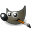

## 👋 Brief description

Hey! My name is Rojohn and I'm 22 years old. I'm currently studying at 42 Malaga and a Higher Technician Diploma in Web Development Application.

> ***I don't program, I do magic.***

## 🛠️ Skills

<table>
    <thead>
        <tr>
            <th></th>
            <th>🎓 Experimented</th>
            <th>👓 Experimenting</th>
        </tr>
    </thead>
    <tbody>
        <tr align=left>
            <th>🔤 Languages</th>
            <td>
                
                
                
                
                
                
                
                
                
                
                
            </td>
            <td>
                
            </td>
        </tr>
        <tr align=left>
            <th>✔️ Version Control</th>
            <td>
                
                
            </td>
            <td>
            </td>
        </tr>
        <tr align=left>
            <th>🎆 Frameworks</th>
            <td>
                
                
            </td>
            <td>
            </td>
        </tr>
        <tr align=left>
            <th>📥 Virtualization</th>
            <td>
                
                
            </td>
            <td>
            </td>
        </tr>
        <tr align=left>
            <th>📝 Documentation</th>
            <td>
                
                
            </td>
            <td>
            </td>
        </tr>
        <tr align=left>
            <th>⌨️ Editor</th>
            <td>
                
                
                
                
            </td>
            <td>
            </td>
        </tr>
        <tr align=left>
            <th>🖥️ OS</th>
            <td>
                
                
                
                
                
            </td>
            <td>
            </td>
        </tr>
        <tr align=left>
            <th>🐚 Terminal</th>
            <td>
                
            </td>
            <td>
            </td>
        </tr>
        <tr align=left>
            <th>🖌️ Design</th>
            <td>
                
                
            </td>
            <td>
            </td>
        </tr>
    </tbody>
</table>

## 📚 Projects

I have my projects divided on different organisations:
- [ribana-b](https://github.com/ribana-b): Projects related to 42 School
- [ribaban-DAW](https://github.com/ribaban-DAW): Projects related to Higher Technician Diploma Web Application Development

## 💯 Stats

<table align=center>
    <tr>
        <td colspan=2 align=center>
                
        </td>
    </tr>
    <tr>
        <td>
            
        </td>
        <td>
              
        </td>
    </tr>
</table>

<section align=center>
    

        
    

    

        
    

</section>

## 🦔 More about me

- I can **speak Spanish** _(Native)_, **English** _(B2)_, **Tagalog** _(A2)_ and **French** _(A1)_.
- My **favourite animal** is the **hedgehog**.
- I'm always **listening to music**.
- I like to watch **anime** and sometimes I **read** manga.
- My **favourite character** is **Chopper** from One Piece.
- I used to **play videogames** a lot, but now I _**do magic**_.

## 💡 Random Facts

- Learning how to say "I don't know how to speak `language` " in `language` might be helpful!
- My name is often mispronounced. It should be _ɹɑ-dʒæn_ (IPA) _roh-jahn_ (SPA)

## 😊 Connect with me

